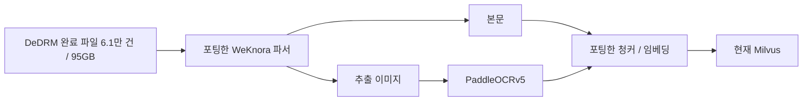
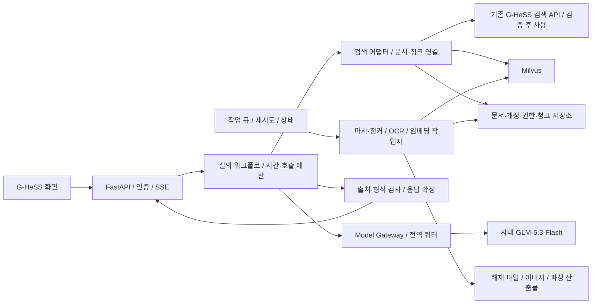

# GHeSS 문서 AI 솔루션 재설계안

작성 기준: 2026-09-14 · 상태: 현재 구현 기반 설계 제안 · 원문: 루트의 「GHeSS AI Agent 서비스 아키텍처 초안」, 작성 기준 2026-08-03, 24쪽.

## 1. 설계 결론

현재 파서·청커·PaddleOCRv5·Milvus 적재를 활용하면서 **FastAPI 안에 제한된 검색·답변 워크플로**를 구현한다. 일반 질의의 분기·검색·인용 검사는 코드가 처리하고 GLM-5.3-Flash는 검색 근거의 답변 작성에 기본 1회 사용한다. 별도 라우터 모델, 상시 LLM 검증, 전 문서 VLM 재해석은 기본 경로에서 제외한다.

현재 검색 품질을 확인하기 전에 샤드나 청커를 일괄 교체하지 않는다. 우선순위는 **문서/개정/출처 추적 → OCR 품질 구분 → G-HeSS 검색 API와 문서·청크 연결 → 모델 호출량 제한 → 실측 기반 인덱스·자원 조정**이다. 전체 재임베딩은 필요한 변경에서만 수행한다.

기존 G-HeSS 검색 API 재사용을 1차 통합안으로 둔다. 검색 API의 문서 ID·개정·권한·페이지 처리 계약이 충족돼야 한다. Elasticsearch 직접 접근이나 신규 청크 색인은 이 계약과 검색 성능이 부족할 때의 대안이며 아직 확정하지 않는다.

## 2. 사실, 해석, 미확인 조건

| 구분 | 내용 | 설계에 미치는 영향 |
|---|---|---|
| 사용자 확인 | FastAPI 기반 개발, 사내 GLM-5.3-Flash 속도·성능 제약 | Python 서비스, 외부 모델 다중 호출 최소화 |
| 사용자 확인 | DeDRM 완료 파일 약 61,000여 건, 약 95GB | 현재 파일은 해제 완료 상태. 95GB를 암호화 원본 크기나 벡터 크기로 해석하지 않음 |
| 사용자 확인 | WeKnora 파서와 청커를 포팅하여 사용 | 포팅 코드·설정과 이미 생성한 산출물 재사용 |
| 사용자 확인 | 이미지를 별도 추출하고 PaddleOCRv5 결과도 임베딩하여 Milvus 적재 | 적재 이후의 품질·출처·검색 통제가 주요 개선 지점 |
| 사용자 확인 | 별도 샤드 설정 없이 적재 | 실제 기본값·인덱스·컬렉션 상태 확인 필요. 장애 원인이라는 증거는 아님 |
| 사용자 확인 | 기존 G-HeSS의 Elasticsearch 검색 기능 API 재사용 검토 중 | 문서 검색 결과를 청크 근거로 변환하는 어댑터 필요 |
| 사용자 예상 | 08~18시 이용자 약 1,500명 | 일 10시간·일일 이용자 1,500명으로 해석. 동시접속 1,500명 가정이 아님 |
| 로컬 증거 | 현재 폴더는 설계 PDF 중심, 서비스 소스·배포 설정 없음 | 실제 코드 리뷰·성능 측정 결과로 표현하지 않음 |
| 미확인 | 포팅한 WeKnora 커밋, 청크 길이/중복/분할 단위, OCR 인식 모델·언어 설정 | 현재 결과를 샘플 검증하고 변경 범위를 결정 |
| 미확인 | 실제 유효 청크 수, 임베딩 모델/차원, Milvus 버전·인덱스·복제·자원 | 메모리는 청크 수·차원 기반 시나리오로만 산정 |
| 미확인 | 사내 모델 동시 호출/RPM/TPM/TTFT/tok/s, 스트리밍·출력 제한·thinking 제어 | 공개 모델 이름에서 사내 제공 성능을 추론하지 않음 |
| 미확인 | 일일 신규·개정량, 문서 권한·폐기 동기화, 검색 API 계약, RDB/큐 가용성 | 인터페이스와 검증 기준을 먼저 정의 |

이후 표의 숫자·구성은 명시적으로 확정이라고 표시한 항목 외에는 **제안 또는 계획 가정**이다. 다른 경로에서 확보한 실제 구현 자료를 검토한 것은 아니다.

## 3. 기존 초안 대비 변경

| 기존 근거 | 기존 설계 | 이번 설계 |
|---|---|---|
| PDF p.3, p.15 | 모델·인프라 대체로 가용, 복수 VLM 후보 | 확인된 GLM과 현재 OCR을 기본으로 사용; 미확인 모델은 선택 확장 |
| p.9~11 | Router·탐색·해석·Verifier 다중 에이전트 | 기능 모듈은 유지하되 실행은 결정적인 Python 워크플로. 모듈 수를 모델 호출 수로 만들지 않음 |
| p.7 | 재작성 1회 + 검증 + 재생성 1회 | 기본 생성 1회, 추가 호출은 명시적 확장 모드에서 총 2회 이내·공유 시간/토큰 상한 적용 |
| p.5~7, p.22 | 검색 시점 권한 필터와 재랭킹 후 필터가 혼재 | 각 검색 축에서 권한 제한, 본문 조회 전 최신 권한 확인, 외부 노출·다운로드 때 재확인 |
| p.5~6, p.12 | 기존 ES 클러스터에 청크 인덱스 신설 우선 | G-HeSS 검색 API 재사용을 먼저 검증; 문서 단위 순위와 청크 단위 근거를 분리 |
| p.12~16 | OCR/VLM 자동 승격, 도식 Mermaid 재구성 | 기존 OCR 유지. 인식 문자와 원본 이미지 링크부터 제공; 도식의 방향·절차·표 구조 복원은 별도 품질 검증 후 도입 |
| p.12, p.18 | 전 문서 요약 자산 생성 | 요청이 많은 문서의 개정별 요약부터 생성. 기본 검색 가용성을 요약 완료에 종속시키지 않음 |
| p.18, p.21 | 벡터 제품 미정, 일반 배포 토폴로지 | 현재 Milvus 기준; 샤드·인덱스·질의 복제본·스토리지 역할 구분 |
| p.17 | 전체 색인 완료 후 개정 전환 | 양쪽 검색의 상태 차이를 인정하고, 문서별 serving revision과 출처 manifest로 확정 |
| p.23~24 | 구축 시작을 가정한 W1~W9 | 현재 적재 현황부터 점검하는 단계별 전환. 검증 결과에 따라 선택적 수정 |

## 4. 현재와 목표 구성

현재 구현은 아래처럼 이해했다. 본문과 OCR의 실제 필드·컬렉션 분리 여부, 출처 메타데이터 수준은 아직 확인되지 않았다.

목표는 하나의 FastAPI 서비스 코드베이스와 별도 배치 프로세스다. 클래스별 마이크로서비스는 만들지 않는다.

문서·권한 정본은 G-HeSS이고, 서비스에는 이를 참조하는 매핑·개정·작업 상태가 필요하다. 별도 RDB가 승인돼 있으면 그곳에 두고, 이미 제공되는 사내 저장소로 동일 계약을 구현할 수 있으면 재사용한다. 검색 인덱스 자체를 권한·최신 개정의 유일한 정본으로 삼지 않는다.

### FastAPI 실행 경계

| 모듈 | 책임 | 모델 호출 |
|---|---|---|
| `api` | SSO 컨텍스트, 입력 검증, 요청 ID, 세션, SSE, 취소 | 직접 호출 없음 |
| `workflow` | 의도 규칙, 단계 전이, 요청 전체 데드라인·예산 | Gateway를 통해서만 |
| `retrieval` | G-HeSS API, Milvus, ID 매핑, 권한 제한, 순위 병합 | 질의 임베딩만; 생성 모델과 별도 자원 |
| `answer` | 컨텍스트 구성, 출처 태그, 출력 검사, 폴백 | 기본 답변 1회 |
| `model_gateway` | 사내 API 계약, 연결 풀, 전역 동시성/RPM/TPM, 계측 | 실제 외부 호출 접점 |
| `ingestion` | 현재 파서·청커/OCR 재사용, 증분 적재, 실패·재개 | 배치 임베딩; 선택적 요약 |
| `repositories` | 문서/개정/청크/작업/메시지/정책 버전 저장 | 없음 |

I/O 대기는 비동기 클라이언트로 처리한다. 동기 Milvus SDK나 검색 클라이언트를 쓴다면 제한된 실행 풀로 감싸고, 일반 함수가 `async def` 내부에서 호출된다는 이유만으로 비동기화됐다고 간주하지 않는다. CPU 파싱·OCR을 이벤트 루프에 넣지 않는다. FastAPI는 I/O 동시성과 CPU 병렬 처리를 구분해 설명하며, 무거운 백그라운드 계산에는 별도 작업 처리를 제안한다. [FastAPI 비동기](https://fastapi.tiangolo.com/async/), [BackgroundTasks](https://fastapi.tiangolo.com/tutorial/background-tasks/).

온라인 LLM 대기를 이유로 처음부터 별도 Agent Worker를 두지는 않는다. FastAPI가 제한된 수의 비동기 요청을 유지한다. 영속 실행·긴 요약·재시작 후 이어하기가 필요한 작업만 작업 큐로 보낸다. 큐는 기존 사내 메시징 우선이며, 미제공 시 승인된 RDB의 작업 테이블과 lease 기반 claim이 최소 대안이다. `BackgroundTasks`를 전량 색인 작업의 유일한 실행 기록으로 사용하지 않는다.

## 5. 질의 실행 로직

### 5.1 모드와 호출 예산

| 요청 | 처리 | GLM 호출 |
|---|---|---:|
| 문서번호/제목 직접 찾기 | 정규화 → 문서 후보 → 권한·개정 확인 → 링크·메타 | 0 |
| 검색 목록 보기 | 검색·순위 병합 → 청크 발췌·출처 | 0 |
| 일반 문서 질의응답 | 검색 → 근거 구성 → 짧은 답변 → 출처 검사 | 기본 1 |
| 근거 부족/검색 장애/권한 미확인 | 해당 상태 설명, 가능한 검색 결과 제시 | 0 |
| 지정 문서 요약 | 동일 개정 요약 재사용; 없으면 지정 범위 요약 | 0 또는 1 |
| 긴 문서 전문 요약·다문서 비교 | 범위와 예상 대기 표시 → 별도 작업 | 고정 1회로 계산하지 않음 |
| 복잡 질의 확장 모드 | 필요 시 재작성 1회 + 답변 1회 | 전체 최대 2 |
| 문서 작성·Checklist·알림/결재 | 후속 단계. 승인된 템플릿·규칙과 별도 API 계약 | 온라인 기본 경로 제외 |

호출 횟수는 예외·재시도까지 포함한 **요청 공통 카운터**로 제한한다. 라우터·검증기·도구가 각자 재시도 1회씩 허용하는 방식은 사용하지 않는다. 산정의 호출 계수 1.05는 일부 확장/재시도가 섞인 트래픽 평균 가정이며 모든 질문에 2회를 허용한다는 뜻이 아니다.

### 5.2 기본 순서

1. 사용자·부서·Site·문서 접근 범위를 신뢰 가능한 인증/권한 서비스에서 얻는다. UI 필터와 모델 출력은 권한의 근거가 아니다.
2. 입력을 정규화하고 문서번호·선택 문서·요약 버튼·개정 비교 등 명시적 신호로 분기한다. 모호한 경우 기본 검색을 실행하며, 특정 문서를 임의로 선택하지 않는다.
3. G-HeSS 검색 API와 `질의 임베딩 → Milvus`를 가능한 범위에서 겹쳐 실행한다. 두 호출의 실패 상태를 분리한다.
4. 권한·개정·ID 매핑을 검증하고 후보를 구성한다. 결과가 부족하면 도메인 약어 사전·띄어쓰기·문서번호 변형을 이용한 G-HeSS API 보완 검색을 최대 1회 수행한다. 질의 임베딩은 다시 만들지 않으며 두 번째 Milvus 검색 슬롯은 문서 ID 기반 근거 보완에만 사용한다. 고정 cosine 점수를 정답 확률로 취급하지 않는다.
5. 생성 가치가 없는 단순 문서 탐색은 링크·발췌로 종료한다. 근거가 부족하면 “확인 가능한 검색 범위에서 근거를 찾지 못했습니다”로 응답한다. 장애를 “문서에 없음”으로 표현하지 않는다.
6. 중복을 줄인 근거를 문서당 최대 2개, 전체 약 4~6개 청크에서 시작해 입력 예산에 맞춘다. 표/조항 경계가 잘렸다면 부모 섹션 또는 이웃 청크를 추가하되 동일 예산 안에서 대체한다.
7. 생성 슬롯과 토큰 예산을 확보해 GLM을 1회 호출한다. 사용자가 취소하거나 요청 시간이 끝나면 연결을 취소한다. 공급자가 실제 추론을 중단하는지는 별도 확인한다.
8. 출처·개정·구조를 검사해 응답을 확정하고 근거 목록·모델/프롬프트/정책 버전을 저장한다. 의미적 정확성까지 자동 보장됐다고 표시하지 않는다.

### 5.3 컨텍스트와 답변

시작 설정은 **평균 입력 4,000토큰, 입력 상한 6,000토큰, 평균 출력 400토큰, 출력 상한 600토큰**이다. 사내 endpoint에서 측정·조정할 값이며 모델의 컨텍스트 윈도우 주장이 아니다. 입력은 시스템 지시 약 600, 질문/메타 약 400, 대화 약 400, 근거 약 2,600토큰을 평균 목표로 배분한다. 긴 이력은 최근 턴과 명시적인 선택 문서 ID를 유지하고, 매 턴 LLM 요약 호출을 하지 않는다.

한글 문자 수와 토큰 수를 같다고 보지 않는다. 사내 제공 tokenizer 또는 usage 반환값으로 보정한다. 모델이 추가 추론 토큰을 소비하면 그 양·시간·TPM 포함 여부까지 측정하고, thinking 비활성화는 실제 API가 지원하는 옵션에만 적용한다. Tool calling·JSON 모드·vision 지원을 모델 이름으로 추정하지 않는다.

근거 형식은 `[S1] 문서번호 / Rev / 페이지·절 / 원문 발췌`다. 모델은 이 목록의 식별자만 인용한다. 후처리는 식별자 존재, 접근 가능성, 개정 일치, 인용 구간의 원문 존재, 수치·단위 불일치 신호를 확인한다. **인용 ID가 존재한다는 사실은 답변 주장이 참이라는 증거가 아니다.** 같은 GLM으로 다시 판정해도 독립적인 정확성 보장은 없다.

일반 설명은 인용 형식 검사를 통과한 문장/블록 단위로 전송할 수 있다. 규정 수치·작업 순서처럼 오해 비용이 큰 응답은 근거 원문 발췌와 링크를 우선 제공하고, 자유 생성은 완성 후 검사해 전송한다. 이미 노출한 토큰을 나중에 “검증 완료”로 소급하지 않는다. 검색 발췌를 먼저 표시하면 모델이 느려도 사용자가 원문을 열 수 있다.

## 6. 기존 G-HeSS 검색 API와 Milvus 연결

### 6.1 API 재사용의 필수 계약

다음은 실제 API가 이미 제공한다는 주장이 아니라, 연계 가능성을 판단할 체크 항목이다.

| 항목 | 필요한 정보·동작 | 부족할 때 |
|---|---|---|
| 안정적인 문서 ID | `source_document_id`, 정규화 문서번호, 개정 식별자 또는 개정일 | ID 매핑을 먼저 구축. 제목만으로 자동 연결 금지 |
| 검색 범위 | 사용자 권한, Site/상태/문서번호 필터, API 인증 위임 방식 | 권한 있는 문서임을 확인하기 전 내용·제목·건수 노출 금지 |
| 결과 | 순위, 문서 메타, 원문 링크, 가능하면 검색 발췌와 위치 | 순위는 후보 선별에만 사용. 발췌를 원문 청크로 검증 |
| 페이지 처리 | page/cursor/limit, 최대 반환 수, total의 의미 | 과도한 API 페이지 순회 금지. 최대 후보 수를 제한 |
| 개정/폐기 | 최신 반영 시각·색인 지연, 폐기 결과 제외 | 서비스 측 정본 manifest와 대조하고 오래된 후보 제외 |
| 처리 한도 | p50/p95, 동시/RPM 한도, 오류 코드, Retry-After | 별도 연결 풀·짧은 timeout·회로 차단, 단독 Milvus 모드 표시 |
| 운영 | 서비스 계정 범위, 장애 담당, 계약 변경·버전 | 문서화된 계약 테스트로 회귀 검증 |

기존 API가 제공하는 검색 방식·분석기·점수는 미확인이다. Elasticsearch가 내부에 있다는 이유만으로 API의 결과를 BM25 청크 점수로 해석하지 않는다. ES API 점수와 Milvus 유사도를 직접 더하지 않는다.

### 6.2 문서 순위와 근거 청크를 분리한 병합

1. G-HeSS API에서 권한 범위 내 상위 20개 **문서** 후보를 받는다.
2. Milvus에서 권한/상태 필터를 적용해 상위 40개 **청크** 후보를 받는다. 문서별 대표 순위를 만들 때 동일 문서의 청크 개수로 점수를 누적하지 않는다.
3. `source_document_id + revision_id`로 동일 문서를 매핑한다. 문서 단위에서 `RRF(d)=Σ w_i/(60+rank_i(d))`를 초기 병합안으로 사용한다. 60과 가중치 1:1은 시작값이며 평가셋으로 선택한다.
4. ES에만 나타난 문서도 근거 후보가 될 수 있도록, 상위 문서 ID 묶음으로 **권한 제한된 Milvus 보완 검색 1회**를 수행한다. 사용 버전에서 지원하는 grouping을 검증한 뒤 문서별 후보를 제한한다. 그룹 검색이 없다면 제한된 결과를 서비스에서 문서별로 묶으며, 근거를 못 찾은 문서는 링크만 제공한다.
5. 최종 문서 순위와 청크의 질문 관련성·본문/OCR 출처·중복·최신 개정을 함께 반영해 근거 4~6개를 선정한다. 모든 페이지나 모든 문서 본문을 생성 모델에 전달하지 않는다.

기본 호출량 상한은 질문당 **G-HeSS API 1회(문자열 보완 시 최대 2), 질의 임베딩 1회, Milvus 검색 최대 2회**다. 두 번째 Milvus 호출은 최초 질의 벡터를 재사용하는 문서 ID 제한 검색이며 재작성·새 임베딩을 추가하지 않는다. 명시적 확장 모드에서 LLM으로 재작성하려면 첫 검색 전에 그 1회를 사용해 확정한 질의를 임베딩하고, 동일 검색 예산을 적용한다. 문서 후보 수만큼 N개의 검색/API를 무제한 호출하지 않는다. ES에만 존재하고 현재 Milvus에는 없는 문서는 “검색 가능·답변 근거 미적재” 상태로 구분한다.

| 실패/불일치 | 응답 동작 |
|---|---|
| G-HeSS 검색 API timeout | Milvus 결과가 유효하면 제한 검색으로 답변, 검색 범위 축소 표시 |
| Milvus/질의 임베딩 실패 | G-HeSS 문서 링크와 검증 가능한 발췌 제공; 정밀 근거가 없으면 생성 생략 |
| 두 축 모두 실패 | 일시적 검색 장애. “관련 문서 없음”으로 저장하지 않음 |
| 문서 ID 미매핑 | 링크만 제공. 임의로 비슷한 제목의 청크를 인용하지 않음 |
| 개정 불일치 | 최신 개정의 근거 확보 전 확정 답변에 사용하지 않음 |
| 인가 서비스 실패 | 보호 문서 검색·본문·기존 답변 재노출 중단 |

API 재사용이 불가능하거나 결과 단위/정확 일치 품질이 부족할 때만 별도 키워드 축을 검토한다. 후보는 기존 ES의 청크 색인 또는 배포 버전과 한글 분석 품질이 검증된 Milvus BM25다. Milvus의 full-text 기능 존재와 현재 설치 환경에서의 사용 가능성은 구분한다. [Milvus full-text search](https://milvus.io/docs/full-text-search.md).

## 7. 파서·청커·OCR 개선

### 7.1 유지하면서 확인할 사항

WeKnora 포팅 코드를 버전과 로컬 수정 내역으로 식별한다. 최신 upstream으로 바로 교체하지 않는다. 문서 200개 정도를 형식·크기·이미지 비율·Site로 나눠 샘플링하고, 파싱 산출물과 원문을 비교한다. 오래된 Office, 이미지 중심 PDF, 표·도식·한글/영문 혼재, 개정 문서를 포함한다.

청커는 현재 설정을 기준선으로 유지하되 다음을 확인한다: 길이 단위가 문자/토큰 중 무엇인지, overlap 중복, 페이지/섹션 연결, 표 헤더 반복, 한글 문장 절단, 부모 청크 참조, 이미지 OCR의 본문 삽입 위치, 문서 경계 혼합 여부. 목표 300~500토큰·overlap 10~15%는 실험 후보이며 현재 설정이라는 뜻이 아니다.

### 7.2 OCR 텍스트의 취급

PaddleOCRv5로 문자가 인식됐어도 표의 셀 관계나 도식 화살표·빨간 박스의 의미까지 복원됐다고 보지 않는다. 공식 문서도 OCR과 표/레이아웃 등 별도 기능을 구분한다. 실제 한글 인식 모델·언어 사전도 확인해야 하며 제품 버전 이름만으로 한국어 품질을 확정하지 않는다. [PP-OCRv5 공식 문서](https://www.paddleocr.ai/main/en/version3.x/algorithm/PP-OCRv5/PP-OCRv5.html).

| 자산 | 기본 처리 | 생성 근거 사용 |
|---|---|---|
| 디지털 본문 | 기존 추출 텍스트 + 페이지/절 | 기준 근거 |
| 스캔 문자 | OCR 텍스트 + 좌표·confidence | 한글/수치 샘플 정확도와 품질 기준 충족 시 |
| 표 이미지 | 원본 + OCR 라벨, 가능한 행/열 정보 | 셀 대응 검증 전 수치 관계를 재구성하지 않음 |
| 화면 캡처·순서도 | 주변 설명·OCR 라벨·원본 링크 | 화살표 방향/조작 순서는 원문 설명이 있을 때만 |
| 로고·반복 머리말 | 해시·위치·규칙으로 중복 관리 | 기본 생성 근거에서 제외 |
| 판독 저품질 | 검색 보조 또는 격리, 원본 접근 경로 | 확정 근거에서 제외 |

필수 출처 필드는 `document_id, revision_id, chunk_id, origin_type, asset_id, page/slide/sheet, bbox 또는 절/셀 위치, parser_version, chunker_version, ocr_model, quality_status`다. OCR confidence는 정확성 확률로 사용하지 않고, 결손·문자 오류·숫자/단위 보존을 평가하는 입력으로만 사용한다.

동일 이미지의 OCR 결과는 콘텐츠 해시로 재사용할 수 있지만, 이미지가 쓰인 문서·개정·주변 문맥과 권한은 각각 보존한다. 디지털 본문과 OCR이 같은 문구를 중복 생성했는지 확인하고, 중복 청크가 검색 상위를 도배하지 않도록 검색 단계부터 중복을 억제한다.

현재 메타가 있으면 재랭킹/필터만 변경한다. 누락됐으면 원본-산출물 매핑에서 보강한다. OCR 결과를 무조건 전량 삭제하지 않고, 품질이 확인되지 않은 구간의 답변 사용 범위를 줄인다. VLM은 실제 가용성·품질·처리 예산이 확인된 뒤 실패 유형에 한해 추가한다.

## 8. Milvus 설계와 샤드 판단

**별도 샤드 설정 없음 ≠ 벡터 검색 불가 또는 성능 부족.** 현재 컬렉션의 shard/channel, 세그먼트, 인덱스, load 상태, query replica, 메모리 사용량을 먼저 확인한다. 실제 의미와 변경 방법은 설치 버전 기준으로 확인한다. Milvus는 스토리지·계산과 역할별 컴포넌트를 나누며, 질의 복제본은 메모리에 적재한 데이터의 복제다. [아키텍처](https://milvus.io/docs/architecture_overview.md), [컬렉션](https://milvus.io/docs/manage-collections.md), [질의 복제본](https://milvus.io/docs/replica.md).

| 개념 | 조절하는 대상 | 이번 판단 |
|---|---|---|
| 컬렉션 | 스키마/차원/인덱스·데이터 집합 경계 | 임베딩 모델·차원이 같으면 공유 가능. 모델/차원 변경은 새 컬렉션 |
| 샤드 | 데이터 유입·분배의 병렬성 | 쓰기/세그먼트 병목 증거 없이 문서 수 기준으로 늘리지 않음 |
| 파티션/partition key | 데이터 범위·분할·필터 효율 | Site/업무별 분리가 평가상 필요할 때. 사용자/문서마다 생성하지 않음 |
| ANN 인덱스 | 검색 recall·지연·RAM/디스크 | 현재 인덱스 기준선과 HNSW/가용 대안 비교 |
| 질의 복제본 | 읽기 처리량·가용성·RAM | 운영 HA 요구와 버전/배포 모드 충족 시 2개 검토 |
| scalar 인덱스/필터 | 문서·개정·Site·권한·출처 조건 | 실제 필터를 포함해 검색 평가 |

Milvus 필터는 ANN 탐색 범위를 줄일 수 있다. 권한·Site·상태 필터를 검색 요청에 적용하되 서비스에서 생성한 조건만 허용한다. 모델이 필터 문자열을 직접 생성/실행하게 하지 않는다. 청크 조회·부모 확장·캐시 적중에도 같은 권한 규칙을 적용한다. [Filtered search](https://milvus.io/docs/filtered-search.md).

현재 필드가 부족할 경우 추가 가능성은 버전·schema 설정으로 확인한다. 컬렉션 재구성이 필요해도 **기존 벡터를 이관할 수 있으면 재임베딩하지 않는다.** 실제 `num_entities` 하나만으로 유효 벡터 수를 단정하지 말고 개정·삭제·중복·미색인/미적재 세그먼트를 구분해 집계한다.

HNSW는 검증 후보로 `M=16`, `efConstruction=200`, 검색 `ef=64/128/256` 등을 비교할 수 있다. 이는 권장 확정값이 아니다. 현재 인덱스가 이미 SLA를 만족하면 그대로 둔다. 필터 선택도 1%/10%/100%, 일반 질의/문서번호, 동시 검색 및 삽입 중 p95·recall을 비교한다. [HNSW](https://milvus.io/docs/hnsw.md).

## 9. 개정·권한·저장 모델

### 9.1 최소 레코드

| 데이터 | 주요 키·속성 |
|---|---|
| 문서 manifest | `source_document_id`, 문서번호, `source_effective_revision_id`, `serving_revision_id`, 정본 확인 시각/버전, 상태, `acl_version`, 원문 링크 |
| 개정 | 문서 ID + 소스 개정 ID, effective date, 콘텐츠 해시, 수집 시각, 원본 참조 |
| 청크 | `chunk_id`, 개정, 텍스트 해시, 출처 위치, 부모/이웃, origin/quality, 처리 버전 |
| 벡터 매핑 | 청크 ID, collection/index generation, 임베딩 모델/차원, 색인·검색 가용 상태 |
| 이미지 자산 | asset hash, 문서별 사용 위치, OCR 원본 결과·버전, 품질 상태 |
| 작업 | job ID, 단계, 입력 해시·처리 버전, lease/heartbeat, 시도 수, 결과/오류 |
| 요청 실행·응답 | `(principal_id, request_id)` 유일 키, 요청 본문 해시, 실행권/lease, 참조 문서/개정, 출력, 상태, latency/token/모델·프롬프트 버전 |

벡터·ES 메타는 정본의 사본이다. 정본에서 현재 유효한 `source_effective_revision_id`와 서비스에서 적재가 완료된 `serving_revision_id`를 구분한다. 최신 답변은 두 값이 일치하고 ACL 확인이 성공한 근거만 사용한다. 기존 초안의 “후행 조인 없음”을 절대 조건으로 유지하지 않고, 제한된 후보 수에 대한 권한·개정 배치 확인 비용을 지불한다.

### 9.2 증분 상태 전이

`DISCOVERED → PARSED → OCR_READY 또는 OCR_SKIPPED → CHUNKED → EMBEDDED → INDEX_READY → SERVING`

실패는 `RETRY_WAIT / FAILED / PARTIAL`로 구분한다. 작업 키는 문서·개정·단계·입력해시·처리버전의 조합이며, 적어도 한 번 실행되는 큐에서 중복 작업이 안전해야 한다. lease 만료 후 재실행되더라도 chunk ID와 upsert를 통해 중복 삽입을 방지한다. 같은 문서의 늦게 끝난 구 작업이 새 개정을 덮지 못하도록 소스 개정 순서와 조건부 manifest 갱신을 사용한다.

Milvus와 기존 G-HeSS API에 걸친 원자적 트랜잭션은 없다. 새 개정의 검색 가능성을 확인한 후 `serving_revision_id`를 전환한다. 정본에서 새 개정이 이미 발효됐는데 서비스 적재가 늦으면 구 serving revision을 최신 답변에 사용하지 않고 최신 원문 링크와 적재 지연 상태만 제공한다. 아직 발효되지 않은 개정은 준비 상태로 유지한다. 과거 개정 질문만 사용자 지정 Rev를 명시한 별도 경로로 허용한다.

전환 중 후보에는 양쪽 개정이 섞일 수 있으므로 생성 전에 정본의 현재 유효 개정과 일치하는 근거만 남긴다. 정본 확인에 실패하거나 최신성을 검증할 수 없으면 확정 답변을 보류한다. ES API 반영만 늦으면 최신 Milvus 근거를 쓰는 제한 경로가 가능하다. 사내 API 색인을 서비스가 제어할 수 있다고 가정하지 않는다. Milvus 자체의 consistency 옵션은 이 시스템 간 일관성을 대신하지 않는다. [Milvus consistency](https://milvus.io/docs/consistency.md).

권한 회수·폐기는 별도 고우선 동기화로 차단 상태를 먼저 반영한다. 캐시 키는 사용자/권한 범위 버전·문서 개정·검색 정책 버전을 포함한다. 단순 TTL만으로 권한 회수를 처리하지 않는다. 캐시된 답변·대화 이력도 현재 권한으로 확인하고, 원문/이미지/파생 파일 다운로드 때 다시 검사한다.

95GB가 DeDRM 완료 데이터이므로 문서 파생물·청크·벡터·이미지도 같은 분류와 접근 통제를 따른다. 현재 수집 단계에 불필요한 DRM 해제 서비스를 새로 넣지 않는다. 신규 문서의 공급 계약에는 해제 완료 여부·실패 사유만 명시하고, 신규 DRM 연계는 필요가 확인되면 확장한다.

## 10. 호출 제한, API, 운영

### 10.1 전역 제한과 실패 처리

모델의 동시 호출·RPM·입력/출력/합산 TPM은 전체 FastAPI 인스턴스와 작업자에 걸쳐 관리한다. 프로세스마다 `Semaphore(10)`을 두면 인스턴스 수만큼 한도가 늘어나는 문제를 피할 수 없다. 기존 Redis 등 중앙 저장소의 원자적 예약과 만료/heartbeat를 쓰거나, 미제공 시 동일 기능의 사내 limiter/RDB lease를 사용한다.

토큰은 호출 전에 예약하고 실제 usage로 정산한다. 출력 최대 토큰으로 쿼터를 차감하는 제공자라면 평균 출력이 아닌 예약량을 기준으로 admission을 결정한다. timeout 뒤 공급자 작업이 계속되면 슬롯을 즉시 재사용하지 않고 최대 실행시간/확인 가능한 취소 완료 시점까지 보수적으로 관리한다. 배치와 온라인이 같은 쿼터를 공유하면 온라인 우선 예약을 분리한다.

| 시작 정책 제안 | 값·동작 |
|---|---|
| 전체 온라인 데드라인 | 60초; 모든 단계와 재시도의 합 |
| 생성 대기 | 최대 5초, 대기열도 유한하게 설정 |
| 검색 구간 | 합계 3초 목표; 개별 서비스 timeout은 이 안에서 배분 |
| 모델 | 생성 45초 한도에서 시작. 실제 서비스 시간 분포로 조정 |
| 추가 생성 | 기본 미허용. 명시적 확장 요청만 총 2회·동일 전체 데드라인 |
| 429/일시 장애 | Retry-After와 남은 예산 확인. 무한 재시도 금지 |
| 과부하 | 생성 대신 검색 결과 먼저 제공하거나 429/503 + 재시도 안내 |
| 재시도 우선순위 | 신규 요청과 재시도에 예산 분리, 재시도 폭증 차단 |

### 10.2 제안 API 계약

실제 G-HeSS API 경로는 미확인이다. 아래는 새 FastAPI 서비스의 제안이다.

| 경로 | 동작 |
|---|---|
| `POST /v1/search` | 질문·필터 → 권한 있는 문서와 근거 청크, 사용한 검색 축, 부분 실패 상태 |
| `POST /v1/chat/query` | session ID·query·mode·request ID → SSE 또는 비스트리밍 응답 |
| `GET /v1/documents/{id}` | 권한 확인한 메타/개정/원문·자산 접근 링크 |
| `POST /v1/jobs/summarize` | 긴 요약 요청 → 202 + job ID; 호출/토큰/시간 예산 기록 |
| `GET /v1/jobs/{id}` | 요청자/관리자에게 작업 상태·결과 |
| `POST /v1/jobs/{id}/cancel` | 소유권 확인 후 취소 요청, 실제 취소 상태 반환 |
| `GET /v1/sessions/{id}/messages` | 현재 권한 재검사 후 이력 조회 |
| `POST /v1/admin/reprocess` | 범위·단계·정책버전·idempotency key → 재처리 작업 |
| `GET /v1/admin/pipeline` | 완료/부분/실패·큐 대기·처리량·버전별 통계 |

SSE 이벤트는 `request.accepted`, `search.results`, `generation.started`, `answer.block`, `result.final`, `request.failed`, `request.cancelled`를 사용한다. `result.final`에 상태(`answered / search_only / insufficient_evidence / degraded`), 출처 목록, 실제 사용량을 담는다. 내부 프롬프트나 숨은 추론 내용은 보내지 않는다.

POST SSE는 브라우저 `fetch` 스트림 또는 지원 클라이언트로 처리한다. 일반 EventSource가 임의의 POST body를 보내는 것으로 설계하지 않는다. 초기에는 임의 토큰 지점 재개를 보장하지 않고 완료 응답 재조회만 제공한다. 다중 인스턴스의 중복 생성 방지는 공통 저장소에서 `(principal_id, request_id)` 유일 키와 요청 본문 해시로 **원자적 실행권**을 확보하여 구현한다. 같은 키에 다른 본문은 충돌로 거절하고, 같은 본문이 실행 중이면 진행 상태만, 완료됐으면 현재 권한을 재확인한 저장 결과를 돌려준다.

timeout 후 공급자 실행 여부가 불명확한 `UNKNOWN_PROVIDER_STATE`는 완료/실패와 구분하고 즉시 재생성하지 않는다. lease 만료만으로 외부 호출이 끝났다고 간주하지 않는다. 확인 가능한 취소·공급자 최대 실행시간 경과 후에도 자동 재실행 대신 상태를 확정하고 사용자의 별도 재시도 요청을 처리한다. LB buffering·idle timeout·최대 연결 수를 검증한다.

### 10.3 관측

질의별로 `search_api_ms`, `embedding_ms`, `milvus_ms`, `context_ms`, `queue_wait_ms`, 모델 TTFT, 생성 시간, 전체 p50/p95/p99, 생성 비율, 실제 호출 수, 입력/출력/추론 토큰, 429/timeout, 무근거·축소검색 비율을 기록한다. 모델용 지표와 HTTP 지표를 분리한다.

배치에서는 문서 완료율, 형식별 실패, OCR 이미지 처리량/오류, 문서당 청크 분포, 중복률, 최신 개정 커버리지, 원문-청크 위치 매핑률, Milvus load/index 진행·메모리/디스크·query latency를 추적한다. 로그에는 본문을 기본 남기지 않고, 평가에 필요한 샘플은 권한·보유기간을 제한한다.

## 11. 용량과 배포 방향

산정 세부는 [트래픽·리소스 산정](트래픽_리소스_산정.md), 숫자는 [자동 계산 결과](산정_결과.md)를 따른다.

- 일일 1,500명 × 5질문 = 7,500질문. 평균 0.208 QPS, 피크 5배이면 1.042 QPS(62.5질문/분).
- 생성 비율 75%, 생성 질의당 평균 1.05회, 모델 점유 평균 30초, 목표 이용률 70%이면 온라인에 동시 호출 36개·71 RPM·합산 309,375 TPM이 필요하다. 이는 사내 할당량이 아니다.
- 문서당 60청크·1,024차원 float32 가정이면 366만 벡터이고 원시 벡터 약 14GiB다. 메타·인덱스·여유를 포함한 질의 복제본당 RAM 계획치는 약 52.9GiB로, 64GiB급은 검증 출발점이다. 실제 청크 수/차원/메모리가 우선이다.
- 95GB를 기준으로 원본·추출 이미지·개정·검색 인덱스·백업·재색인 공간을 분리하면 기준 시나리오의 전체 논리 할당은 약 985.5GiB다. 새로 전부 할당하라는 뜻이 아니며 기존 G-HeSS·스토리지의 보유 자원을 차감해야 한다.

FastAPI는 초기 운영안으로 2개 인스턴스, 각각 2~4 vCPU/4~8GiB에서 실측한다. 모델은 사내 제공 서비스이므로 애플리케이션 GPU 0개를 기본 가정한다. PaddleOCR를 CPU로 계속 운영할지 GPU가 필요한지는 이미지 단위 처리량과 증분 마감시간으로 결정한다. Milvus의 운영 모드·HA 구성과 데이터/인덱스/메시징/객체 저장소를 포함한 자원은 별도 산정한다. “API 2대 + Milvus 1대”를 완전한 HA 구성으로 표시하지 않는다.

## 12. 단계별 전환과 완료 기준

| 단계 | 작업 | 다음 단계로 넘어가는 증거 |
|---|---|---|
| A. 현재 상태 계측 | 포팅 버전, schema/index, 실제 청크 수, OCR 샘플, 사내 모델/API 한도 수집 | 환경 명세·기준 성능/품질 보고서. 현재 기능 보존 |
| B. 근거 추적 보강 | 문서 ID·개정·출처·OCR quality, 누락 메타 backfill | 평가 대상 모든 답변 근거에 원문 위치·개정 연결 |
| C. 검색 API 통합 실험 | API-only / Milvus-only / 문서 병합+청크 보완 비교 | 정확 일치·자연어·OCR별 결과와 API 호출량/지연 비교 |
| D. FastAPI 답변 경로 | 0/1회 호출, 전역 limiter, 출처 검사, 취소·과부하 폴백 | 호출 상한·권한·데드라인 테스트 통과 |
| E. 선택적 데이터 수정 | 실패 형식/청크/이미지만 수정, 새 인덱스 필요 시 shadow 검증 | 현재 대비 품질 회귀 없음, 처리비용·롤백 검증 |
| F. 운영 확대 | 제한 사용자 → 기준 피크 → 혼합 부하, 대시보드·회귀 평가 | 품질/SLO·배치 마감·장애 대응 기준 충족 |

문서 작성·개정 비교·Checklist·CUBE/결재 연계는 기본 검색 신뢰도와 처리 한도가 확보된 다음 독립 범위로 설계한다. 일정은 인원·현재 완성도·API 계약이 없으므로 기존 W1~W9를 재확정하지 않는다.

### 수정 종류별 재처리 범위

| 변경 | 파싱/OCR | 임베딩 | 적용 방법 |
|---|---|---|---|
| 권한/문서 메타 보강 | 기존 산출물 매핑으로 가능하면 생략 | 텍스트·모델 동일이면 생략 | 메타 갱신 또는 벡터 이관, API/schema 지원 확인 |
| 검색 병합/필터/프롬프트 | 없음 | 없음 | 설정 버전 전환·회귀 평가 |
| ANN 인덱스/샤드 재구성 | 없음 | 기존 벡터 재사용 가능 | 새 인덱스/컬렉션, 디스크·RAM 확보 후 비교 |
| OCR 오인식 정정 | 해당 이미지/문서만 | 변경 청크만 | 자산·텍스트 hash와 chunk ID 재계산 |
| 청크 정책 수정 | 보존된 파싱 결과부터 | 분할/텍스트가 바뀐 청크 | 영향 문서 제한, 중복·출처 검증 |
| 임베딩 모델/차원 변경 | 보존된 텍스트 재사용 | 대상 전량 필요 | 새 컬렉션·회귀 검증·제어된 전환 |

### 검증 목표 초안

평가셋 200질문 이상을 문서번호·자연어·한글/약어·표/이미지·최신 개정·무근거·권한 음성 사례로 나눈다. 권한 테스트는 부서/사용자 교차, 캐시, 이력, 부모 청크, 파일 다운로드를 포함한다.

| 항목 | 목표와 검증 |
|---|---|
| 접근 통제 | 권한 밖 문서의 제목·본문·이미지·답변 노출 0건; 차단/회수 시나리오 통과 |
| 문서번호 검색 | 표기 변형 포함 정답 문서 Recall@5 ≥99%, 샘플 수 함께 보고 |
| 자연어 검색 | 정답 근거 Recall@10 ≥90%, API-only/Milvus-only 대비 비교 |
| 출처 형식 | 존재하지 않는 source ID 0건, 위치·개정 매핑 100% |
| 의미 정확성 | 사람 채점의 주장 단위 근거 일치 ≥95% 목표, 오류 유형 공개. LLM 자체 점수로 대체하지 않음 |
| OCR | 한글/숫자/단위의 CER·누락률과 표/도식별 실패 목록 측정; 기준 미달은 근거 격리 |
| 응답 시간 | 검색 결과 p95 ≤3초, 일반 생성 응답 p95 ≤60초를 초기 목표로 검증 |
| 호출·과부하 | 기본 경로 GLM ≤1회, 확장 ≤2회; 한도 초과/취소/timeout에서 추가 호출 폭증 없음 |
| 파이프라인 | 같은 작업 재실행으로 중복 유효 청크 증가 0; 구 개정 작업의 역전 덮어쓰기 0 |
| 회복 | 작업자 중단 후 재개, 인덱스 전환 실패 시 기존 세대 보존, 백업 복원 확인. 정본 개정이 바뀌었으면 구 세대의 최신 답변 제공은 차단 |

목표 미달 시 목표를 충족했다고 간주하지 않는다. 검색/출처 품질 → 입력 길이/응답 길이 → 모델 처리 한도 → 인덱스/자원 순서로 병목을 구분하여 수정한다. 수치 기반 실측 절차는 [산정 문서 §7](트래픽_리소스_산정.md#7-실측으로-산정값을-확정하는-절차)을 따른다.

## 13. WeKnora 참조 범위와 결정 기록

공식 upstream 확인 기준은 커밋 [`17f893865d4d8337f7e0bf942c6931a8ce7a08c1`](https://github.com/Tencent/WeKnora/tree/17f893865d4d8337f7e0bf942c6931a8ce7a08c1), 2026-09-13이다. **사용자 포팅본이 이 커밋과 같다는 뜻이 아니다.**

| upstream 요소 | 재설계에서의 사용 |
|---|---|
| Go 주 서비스 + Python docreader | 서비스 핵심은 FastAPI로 구현. 이미 포팅한 파서·청커는 보존 |
| 검색·병합·컨텍스트·인용 단계 | 책임 경계와 처리 순서를 참조; Go 로직 전체 복제 없음 |
| async 작업·모델별 동시성 통제 | 단계별 작업 상태, 온라인/배치 전역 예산으로 구현 |
| 다단 Agent·query understanding·확장 기능 | 사내 GLM 처리 예산에 맞는 경로만 선택 |

근거: [공식 아키텍처](https://github.com/Tencent/WeKnora/blob/17f893865d4d8337f7e0bf942c6931a8ce7a08c1/website-docs/02-architecture/01-overview.md), [RAG 파이프라인](https://github.com/Tencent/WeKnora/blob/17f893865d4d8337f7e0bf942c6931a8ce7a08c1/website-docs/02-architecture/04-rag-pipeline.md), [비동기 작업](https://github.com/Tencent/WeKnora/blob/17f893865d4d8337f7e0bf942c6931a8ce7a08c1/website-docs/02-architecture/05-async-tasks.md), [현재 upstream 청커](https://github.com/Tencent/WeKnora/tree/17f893865d4d8337f7e0bf942c6931a8ce7a08c1/docreader/splitter).

| 결정 | 이유 | 대안·대가 | 재검토 조건 |
|---|---|---|---|
| FastAPI의 제한된 워크플로 | 필수 스택, GLM 지연·호출 통제 | 자율 Agent보다 복잡 질의 유연성 감소 | 복잡 질의 수요·추가 쿼터·평가 통과 |
| G-HeSS 검색 API 우선 실험 | 기존 검색·권한 계약과 운영 자원 활용 | 문서/청크 단위 차이, 외부 API 종속 | ID·권한·개정 계약 미충족 또는 품질 미달 |
| 현재 Milvus 유지·계측 우선 | 이미 적재된 데이터/벡터 재사용 | 현재 schema가 부족하면 이관 필요 | 실제 필터·load·성능 결과 |
| OCR 출처·품질 구분 | 저품질 OCR이 본문과 동일하게 사용되는 위험 통제 | 일부 질의는 이미지 원문 열람으로 종료 | 구조 복원 모델의 가용성·품질 검증 |
| 전 문서 요약·LLM 검증 후순위 | 배치/온라인 모델 쿼터 보호 | 자유형 요약·검증 자동화 범위 제한 | 실수요·근거 정확성·배치 예산 확보 |
| 개정 manifest와 재인가 | 검색 저장소 간 비원자성과 stale ACL 대응 | 후보 배치 조회 비용 추가 | 권한/정본 API 계약 변경 |

문서 이력: 사용자 정정에 따라 “DRM 포함 6만 건”을 “DeDRM 완료 약 6.1만 건”으로 변경했고, 이미 구현된 파서·청커·OCR·적재와 검색 API 재사용 검토를 기준선에 반영했다.
